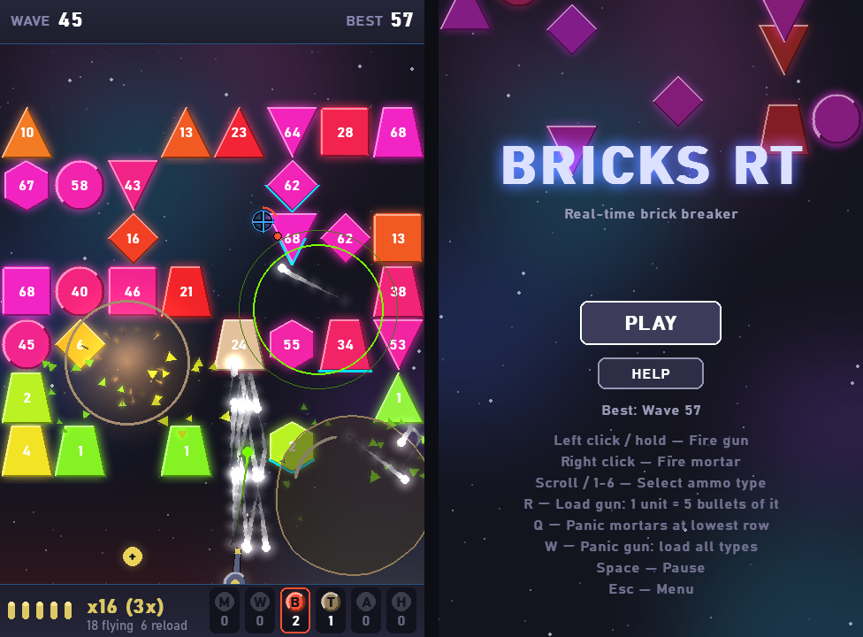

# BricksRT

Real-time brick breaker with gun and mortar mechanics. Based on [Bricks](https://github.com/HaagenHu/Bricks).



## Concept

Bricks advance slowly in real-time. Player has a crosshair and two weapons:

- **Gun (Left mouse):** Fires projectiles — Fireball, Homing
- **Mortar (Right mouse):** Launches area weapons — Bomb, Mine, Acid, Wall,
  Tar (select type with scroll wheel or 1-5)
- **AoE (Pickup):** Field effects — Freeze, Reverse, Lightning, Skull

## Graphics

Neon-vector look, all drawn in code — no image assets:

- **Glow:** additive glow on shots, shells, blasts, pickups, gun and
  crosshair; bricks get a halo in their HP color and a bevel
- **Motion:** shots leave fading trails; bricks flash on hits and shatter
  into shards on kills; blasts, wall breaks and skulls shake the field
- **Explosions:** white-hot core, shockwave ring, sparks and smoke
- **Zones:** bubbling acid, glossy tar, honeycomb energy walls, frost
  while frozen
- **Readability:** mortar rounds mark their landing footprint; bricks
  about to reach the death line flash white with a red glow
- **Gun and HUD:** recoiling turret tinted by the loaded ammo, a mortar
  reload ring on the crosshair, gradient HUD panels, nebula backdrop
- **Menu:** glowing title over falling, shattering demo bricks

See [CHANGELOG.md](CHANGELOG.md) (v0.5.0) for details.

## Sound

Procedural sound effects, synthesized at startup (no audio files):
kills, blasts, mortar launches and landings, pickups, area effects,
game over and new best. Frequent events are rate-limited so busy
moments don't turn into noise. **M** toggles sound.

## Status

Work in progress. Branched from the turn-based Bricks game.

## Requirements

- Python 3.10+
- pygame-ce (`pip install pygame-ce`)
- UI font: Bahnschrift (ships with Windows 10+); falls back to Arial

## Run

```
pip install -r requirements.txt
py main.py
```

Practice start for testing — jump to a wave with a matching arsenal
(the balls a perfect run would have collected by then, ~80% of the
wave number, plus 3 of each unlocked ammo type); records no highscore:

```
py main.py --wave 100
```

## Tests

```
py tests/test_game.py
```
